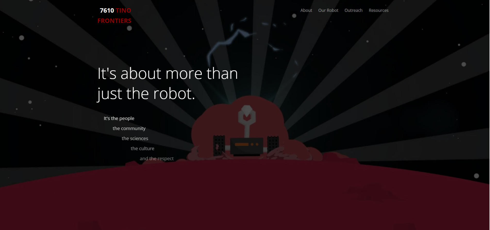
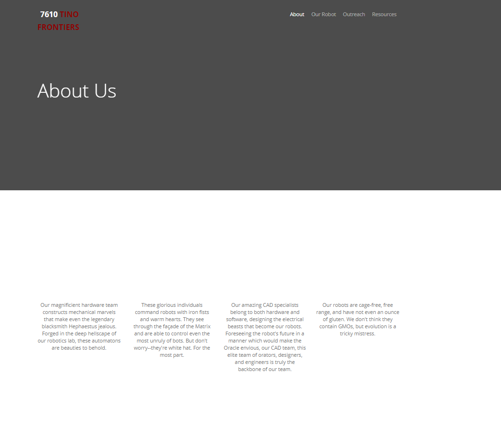
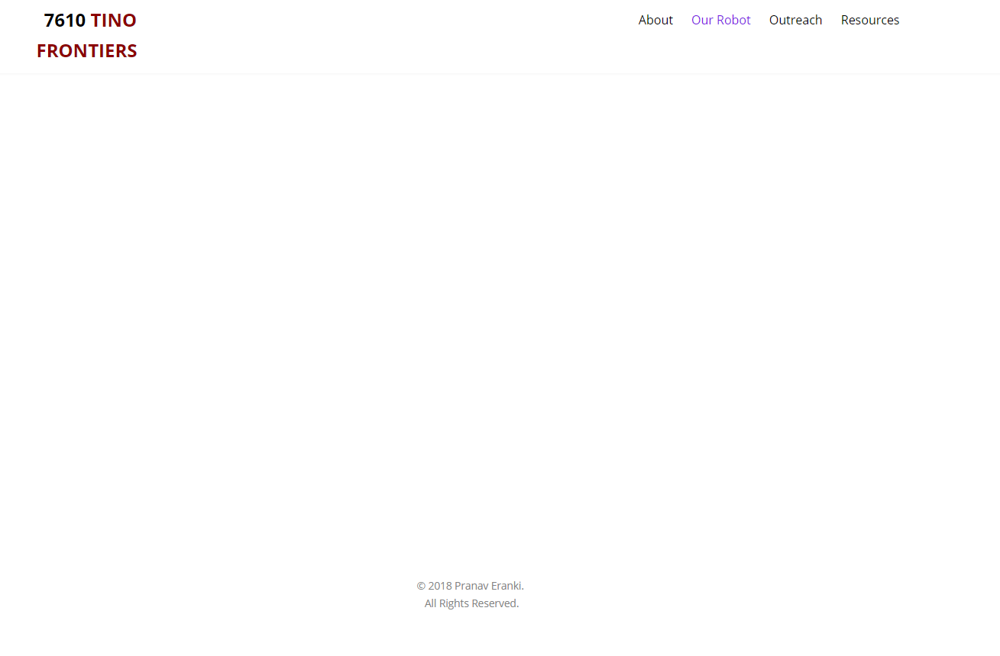
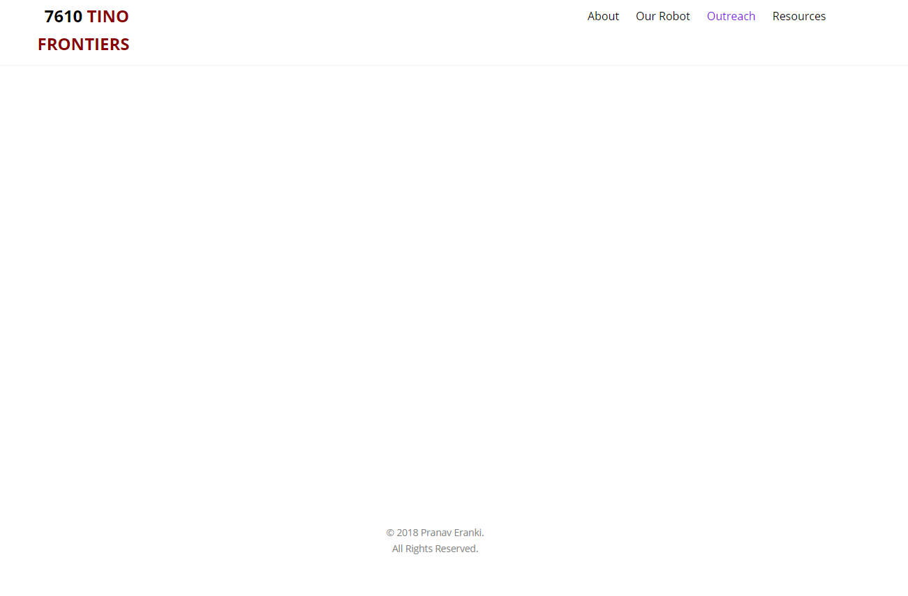
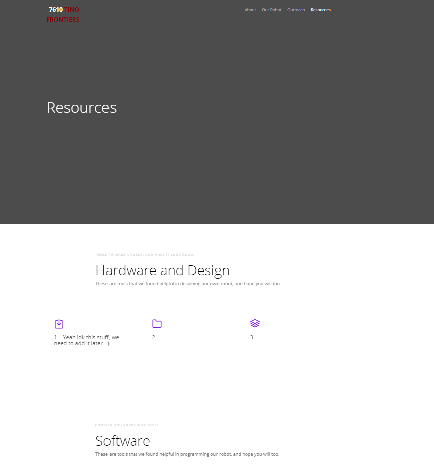

# Website
For the template, download this folder and use only the *Template* folder. All other folders and files not in this folder can be disregarded for template purposes.

__Work in Progress, please submit suggestions__

## Some things to note:
* The logo onload color is white, then it becomes black as you scroll down a bit. Don't be alarmed if the number in the logo does not load immediately.
* This is __incomplete__, meant to be as a template for all the teams to use and create a personal website.
* The website may look extremely empty - don't worry, check the html files
* It would be nice if you could __change up the code__ for yourself, also change the about and bios page, so you could further customize the site.
* Please change the metadata, which is available at the top of every html file, to match your team.
* Please contact me @*pranav.eranki@gmail.com* or talk to me during school if you have any questions.

## How to edit the file
* To complete and customize this website, all you need is some basic HTML and CSS skills. Please ask for help if necessary.
* Comments are placed where you need to put in your custom info.
* Get images and place them in the *images* folder, and reference them in your `<a href = "..">`s

## Template examples
#### Note : Some of these are empty, you must add appropriate content into them.

### Home

### About

### Robot

### Outreach

### Resources

